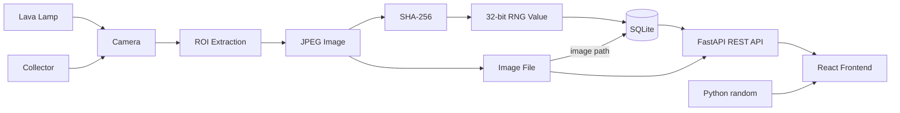

# Physical Entropy

Physical entropy-based random number generator using a lava lamp, SHA-256, FastAPI, SQLite, and Docker.

## How it works

A camera captures the lava lamp and extracts a region containing the moving wax. The captured image is processed with SHA-256, and the first 32 bits of the resulting hash are used to produce a 32-bit random value. The image and generated value are stored for later use, allowing data to be collected when needed instead of requiring the system to be active continuously.

The project also provides a REST API and a web interface for viewing generated samples and comparing their statistical distribution with Python's random number generator.

## API

The project provides a REST API for accessing generated random numbers, sample data, status information, and database statistics. 

### Endpoints

| **Method** | **Endpoint** | **Description** |
|---|---|---|
| GET | `/api/rng` | Generate and consume a random number. Supports optional `minimum` and `maximum` query parameters. |
| GET | `/api/rng/status` | Check the number of available samples |
| GET | `/api/samples` | List collected samples |
| GET | `/api/samples/{id}` | Get a specific sample |
| GET | `/api/stats` | Get dataset statistics |
| GET | `/api/stats/distribution` | Get data for statistical distribution comparison |

## Database

The project uses SQLite for persistent storage. The database and required tables are created automatically when the API starts if they do not already exist.

The database stores:

* Generated RNG values
* Capture timestamps
* SHA-256-derived image filenames
* Algorithm and algorithm version
* Whether a sample has been consumed
* RNG request history

## Data collection

Random samples are collected separately from RNG requests. A collector process captures the lava lamp and stores the resulting sample in the database. Collection is executed manually using `collector.py --samples x --interval y`.

This allows the system to build a backlog of entropy samples while the lava lamp is running. API requests consume previously collected samples instead of requiring the camera and lava lamp to be active at the time of the request.

## Architecture

